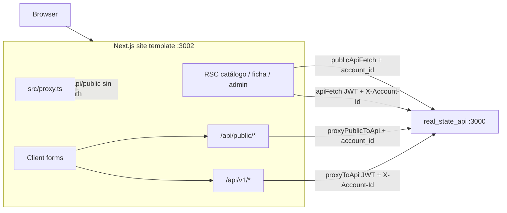
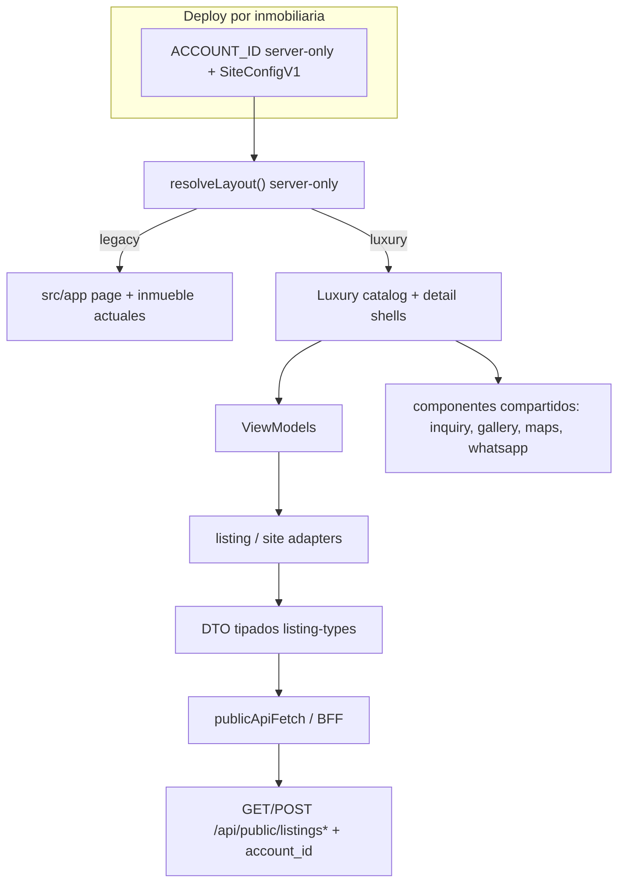

# Luxury layout — implementación (white-label)

| Campo | Valor |
| --- | --- |
| Título | Luxury layout implementation — `real_state_site_template` |
| Estado | Draft |
| Versión | 0.1 |
| Fecha | 2026-08-30 |
| Rama | `docs/luxury-product-spec` |
| Repositorio | `real_state_site_template` |
| Responsables | Por definir (frontend, backend, producto, diseño) |
| Clasificación de afirmaciones | **Comprobado** · **Inferido** · **Propuesto** · **Pending backend confirmation** |

Este documento no es implementación. Toda afirmación sobre el estado actual cita rutas y símbolos del repositorio. No se asume paridad con otros sitios inmobiliarios ni con un backend no presente en este workspace.

---

## 1. Control documental

- Documento vivo de arquitectura para el primer layout comercial **luxury**.
- Complemento: [`docs/api/luxury-endpoint-gap-analysis.md`](../api/luxury-endpoint-gap-analysis.md).
- Única guía de agentes en el repo: [`AGENTS.md`](../../AGENTS.md). No hay otros `AGENTS.md` anidados (**comprobado** vía búsqueda de archivos).
- [`../real_state_api/BUSINESS_RULES.md`](../../../real_state_api/BUSINESS_RULES.md) §6b está referenciado por `AGENTS.md` y `README.md`, pero **el directorio `real_state_api` no está disponible** en este workspace. Las reglas de dominio del API quedan **Pending backend confirmation**.

---

## 2. Resumen ejecutivo

El template ya opera como **un sitio por inmobiliaria y por deploy**: catálogo público, ficha, inquiry, WhatsApp por anuncio, login y admin lite. El aislamiento es **server-only** (`ACCOUNT_ID` → `accountId()` en `src/lib/site-config.ts`). El catálogo actual cubre una parte material del MVP Luxury (búsqueda en URL, grid, ficha, galería, inquiry), pero **no** es un layout premium configurable: el hero es un gradiente con copy fijo, no hay paginación ni sort en UI, no hay `SiteConfig` versionado, no hay registry de layouts, no hay amenidades en los DTO públicos y no hay pruebas ni CI.

La estrategia propuesta es **no reescribir el admin ni el BFF**. Se introduce un **layout registry resuelto en servidor**, un **SiteConfigV1** (env-first, API pública opcional), y una capa **DTO → adapter → ViewModel → UI** solo para superficies públicas. El layout `legacy` (código actual de `/` e `/inmueble/[slug]`) permanece como rollback. Luxury se activa por config de deploy, nunca por selector de workspace en el navegador.

**Bloqueadores de producto (no de código local):** confirmar con backend si `GET /api/public/listings` ya acepta página, sort y filtros extra, y si el detalle público incluye amenidades / estacionamientos. Mientras tanto, el BFF ya reenvía query string completa; no se debe crear un endpoint por componente.

---

## 3. Estado actual comprobado

### 3.1 Arquitectura actual

**Comprobado.** Next.js `16.2.6`, React `19.2.4`, Tailwind `4`, TypeScript `5`. Dependencias de runtime: solo `next`, `react`, `react-dom` (`package.json`). `next.config.ts` exporta un objeto vacío.

Flujo de datos público y staff:



Hay **dos caminos** al API (**comprobado**):

| Camino | Símbolo | Destino |
| --- | --- | --- |
| RSC servidor | `publicApiFetch` (`src/lib/public-api-fetch.ts`) | `apiBaseUrl()` + path público + `account_id` |
| RSC staff | `apiFetch` (`src/lib/api-fetch.ts`) | `apiBaseUrl()` + path `/api/v1/*` + JWT + `X-Account-Id` |
| Browser | `fetch("/api/public/...")` / `fetch("/api/v1/...")` | BFF Next → `proxyPublicToApi` / `proxyToApi` (`src/lib/api-proxy.ts`) |

El catálogo (`src/app/page.tsx`) **no** consume el BFF Next: llama `publicApiFetch("/api/public/listings?...")` directo a Rails. El inquiry (`ListingInquiryForm`) sí POST al BFF Next.

`apiBaseUrl()` (`src/lib/api-url.ts`) resuelve `API_URL` → `NEXT_PUBLIC_API_URL` → `http://localhost:3000`. **Inferido:** `NEXT_PUBLIC_API_URL` existiría para casos legacy; el aislamiento correcto es `API_URL` server-only.

### 3.2 Rutas

**Comprobado** (App Router + `proxy` matcher).

| Ruta | Archivo | Auth | Propósito |
| --- | --- | --- | --- |
| `/` | `src/app/page.tsx` | Pública (`isPublicCatalogPath`) | Catálogo + búsqueda |
| `/inmueble/[slug]` | `src/app/inmueble/[slug]/page.tsx` | Pública | Ficha |
| `/login` | `src/app/login/page.tsx` | Pública; redirige staff a `/listings` | JWT |
| `/listings`, `/listings/new`, `/listings/[id]`, `/listings/setup`, `/listings/inquiries` | `src/app/(admin)/listings/**` | Staff (`requireStaffAccess`) | CRUD anuncios y leads |
| `/properties/**` | `src/app/(admin)/properties/**` | Staff | Propiedades y unidades |
| `/account` | `src/app/(admin)/account/page.tsx` | Staff | Perfil, logo, workspace |
| `/api/public/listings` | `src/app/api/public/listings/route.ts` | Pública | Proxy catálogo |
| `/api/public/listings/[slug]` | `src/app/api/public/listings/[slug]/route.ts` | Pública | Proxy ficha |
| `/api/public/listings/[slug]/inquiries` | `src/app/api/public/listings/[slug]/inquiries/route.ts` | Pública | Proxy inquiry |
| `/api/auth/login`, `/api/auth/logout` | `src/app/api/auth/**` | Pública (API) | Sesión |
| `/api/v1/**` | `src/app/api/v1/**` | Cookie JWT vía `proxy` | Admin lite |

`isPublicCatalogPath` (`src/lib/access-control.ts`) también trata `/robots.txt` y `/sitemap.xml` como públicos, pero **no existen** esas rutas ni `app/robots.ts` / `app/sitemap.ts` (**comprobado**).

No existe `/contacto` (**comprobado**; `AGENTS.md` lo menciona como extensión futura).

### 3.3 Componentes públicos relevantes

| Símbolo | Archivo | Tipo | Rol |
| --- | --- | --- | --- |
| `SiteHeader` | `src/components/site-header.tsx` | Server (async) | Logo/nombre env + Acceder/Administrar |
| `SiteFooter` | `src/components/site-footer.tsx` | Server | Copy + “Tecnología Evenia” si `showPoweredBy()` |
| `PublicCatalogSearch` | `src/components/public-catalog-search.tsx` | Server | Tabs oferta + form GET |
| `PublicListingCard` | `src/components/public-listing-card.tsx` | Server | Tarjeta |
| `ListingOfferBadge` | `src/components/listing-offer-badge.tsx` | Server | Badge renta/venta |
| `ListingPhotoGallery` | `src/components/listing-photo-gallery.tsx` | Client | Carrusel + thumbs |
| `ListingInquiryForm` | `src/components/listing-inquiry-form.tsx` | Client | POST inquiry |
| `ListingWhatsAppButton` | `src/components/listing-whatsapp-button.tsx` | Server | `wa.me/52…` |
| `OpenInMapsLink` | `src/components/open-in-maps-link.tsx` | Client | URL de mapas por UA |
| UI kit | `src/components/ui/*` | Mixto | Admin + forms |

No hay registry de layouts, design tokens luxury, hero con imagen, paginación, sort ni estados `loading.tsx` (**comprobado**).

### 3.4 BFF

Inventario completo y contratos: ver documento de endpoints. Resumen: 3 rutas públicas de listings + auth + proxy staff de account, listings, photos, properties, units, inquiries y `users/me` (solo `PATCH` en BFF).

Caché: todos los fetches usan `cache: "no-store"` (`publicApiFetch`, `apiFetch`, `proxyToApi`, `proxyPublicToApi`).

### 3.5 Configuración

**Comprobado** en `src/lib/site-config.ts` y `README.md`:

| Variable | Consumidor | Público en bundle |
| --- | --- | --- |
| `ACCOUNT_ID` | `accountId()` | No (server-only; lanza si no es dígitos) |
| `API_URL` / `NEXT_PUBLIC_API_URL` | `apiBaseUrl()` | `NEXT_PUBLIC_*` sí si se usa |
| `NEXT_PUBLIC_SITE_URL` | `siteOrigin()`, `listingPublicUrl` | Sí |
| `NEXT_PUBLIC_SITE_NAME` | `siteName()` default `"Inmobiliaria"` | Sí |
| `NEXT_PUBLIC_SITE_TAGLINE` | `siteTagline()` | Sí |
| `NEXT_PUBLIC_SITE_LOGO_URL` | `siteLogoUrl()` | Sí |
| `NEXT_PUBLIC_SHOW_POWERED_BY` | `showPoweredBy()` | Sí |

`README.md` pide copiar `.env.example` → `.env`. **Comprobado:** no hay `.env.example` trackeado (`git ls-files`). El archivo local `.env` no se documenta ni se modifica aquí.

No existe schema `SiteConfig`, validación, versionado ni endpoint público de branding. `GET /api/v1/account` es staff y expone `name`, `timezone`, `currency`, `logo_url` (`src/app/(admin)/account/page.tsx`).

### 3.6 Aislamiento por `ACCOUNT_ID`

**Comprobado:**

- `accountId()` lee solo `process.env.ACCOUNT_ID`.
- `scopedPublicPath` / `proxyPublicToApi.withAccountId` fuerzan `account_id` en query hacia Rails.
- `getBearerAuthHeaders` (`src/lib/api-auth.ts`) setea `X-Account-Id` a `accountId()`, no a cookie ni a input del cliente.
- `findMembership` (`src/lib/account-context.ts`) busca membership del `workspaceAccountId()` (alias de `accountId()`), no un workspace elegido en UI.
- `src/proxy.ts` no ofrece selector de cuenta.
- El catálogo no filtra `listings` por `account_id` en cliente: el scope ya viene del servidor.

`ACCOUNT_COOKIE` (`account_id`) se escribe en login (`writeSessionCookies`) y se lee en `getSessionContext`, pero **no** decide el workspace del deploy.

### 3.7 Scripts existentes

**Comprobado** (`package.json`): `dev` (puerto **3002**), `build`, `start` (3002), `lint`. No hay `test`, `typecheck` ni script e2e.

### 3.8 Pruebas

**Comprobado:** cero archivos `*.test.*` / `*.spec.*`. No hay Playwright, Jest, Vitest ni `.github/`. La calidad actual es `eslint` + `tsc` vía `next build`.

### 3.9 Catálogo y ficha (comportamiento)

**Comprobado** en `CatalogPage` (`src/app/page.tsx`) y `PublicCatalogSearch`:

- URL: `oferta` (`renta`/`venta`/`todas` vía `parseCatalogOfferFilter` / `catalogOfferQueryValue`), `city`, `tipo`, `recamaras`.
- API enviada: `city`, `offer_type` (`rent`/`sale` o ausente si `all`), `property_type`, `bedrooms`, `limit=24`.
- Respuesta tipada: `{ listings: PublicListingCard[]; meta: { total: number } }`.
- Grid: `sm:2 lg:3 xl:4`.
- Empty y error inline. Sin `loading.tsx` / Suspense de resultados.
- Hero: gradiente `from-blue-950 via-blue-900 to-indigo-950`, H1 fijo “Encuentra tu próximo inmueble”, no imagen.

**Comprobado** en ficha (`src/app/inmueble/[slug]/page.tsx`):

- DTO `PublicListingDetail`: card + `description`, `address_label`, `show_exact_address`, `contact_phone`, `photos[]`, `published_at`.
- Specs vía `listingPublicSpecs`: recámaras, baños, terreno, construcción. **No** estacionamientos ni amenidades.
- Mapa: `OpenInMapsLink` si hay `latitude`/`longitude` (enlace, no embed).
- Aside `lg:sticky lg:top-6` con WhatsApp + inquiry.
- SEO: `generateMetadata` con Open Graph / Twitter; `listingShareImage` usa primera foto o `photo_url`.

### 3.10 Tipos y huecos de dominio en este repo

**Comprobado** (`src/lib/listing-types.ts`, `property-types.ts`, `unit-types.ts`):

- Públicos: `offer_type`, `property_type`, `bedrooms`, `bathrooms`, `built_area`, `land_area`, `city`, `colony`, `location_label`, coords opcionales en card.
- Staff listing: mismos campos de inmueble + `status`, `unit_id`, `photos`.
- `Property.parking_spaces` existe en admin; **no** está en `PublicListingCard` ni `PublicListingDetail`.
- Cero menciones a `amenities`, `featured`, `related`, `development`, `remate`, `facet`, `sort` como contrato de catálogo.
- `Tenant` (`src/lib/tenant-types.ts`) es tipo CRM residual; el admin lite no expone portales.

---

## 4. Objetivo del Luxury MVP

Entregar el **primer layout comercial** del template, activable por deploy, sin romper el admin lite ni el aislamiento `ACCOUNT_ID`.

El visitante debe poder: aterrizar en un hero de marca, filtrar (comprar / rentar / todas + ubicación + tipo + recámaras), ver resultados paginados y ordenables en un grid responsive, abrir una ficha con galería y datos, contactar por formulario y WhatsApp, y compartir una URL con SEO coherente.

La inmobiliaria debe poder variar marca, hero, header, footer y WhatsApp vía **SiteConfigV1**, no tocando JSX de negocio.

---

## 5. Alcance

### 5.1 P0 — Luxury MVP

| ID | Capacidad | Estado actual vs objetivo |
| --- | --- | --- |
| P0-01 | Header configurable | Parcial: logo/nombre env; sin nav, CTA, colores |
| P0-02 | Hero premium imagen + copy | Ausente: gradiente y H1 fijos |
| P0-03 | Buscador comprar/rentar/todas + ubicación + tipo + recámaras | Cubierto (labels Renta/Venta/Todas) |
| P0-04 | URL state de filtros | Cubierto |
| P0-05 | Resultados paginados | Parcial: `limit=24` + `meta.total`, sin página |
| P0-06 | Ordenamiento | Ausente |
| P0-07 | Grid responsive | Cubierto |
| P0-08 | Property cards | Cubierto; restyle luxury |
| P0-09 | Loading / empty / error | Parcial: empty/error; sin loading dedicado |
| P0-10 | Detalle | Cubierto; restyle |
| P0-11 | Galería | Cubierto |
| P0-12 | Características | Parcial: falta parking en DTO público |
| P0-13 | Descripción | Cubierto |
| P0-14 | Amenidades | Ausente en DTO; **Pending backend confirmation** |
| P0-15 | Ubicación / mapa | Parcial: link externo |
| P0-16 | Inquiry | Cubierto |
| P0-17 | WhatsApp configurable | Parcial: por anuncio, `52` hardcode |
| P0-18 | Footer configurable | Parcial: nombre + powered-by |
| P0-19 | SEO dinámico | Parcial: metadata; sin JSON-LD / sitemap |
| P0-20 | SiteConfig multi-inmobiliaria | Parcial: funciones env, no schema |

### 5.2 P1 — contemplado, no MVP

Desarrollos, remates, zonas editoriales, destacados, relacionados, i18n, favoritos, comparador, mapa embebido, facets ricos, branding 100% CMS.

### 5.3 Fuera de alcance

- CRM, contratos, cobros, dashboard, portales inquilino/propietario.
- Marketplace multi-inmobiliaria o selector de workspace.
- Filtrar inventario de varias cuentas en el cliente.
- Reimplementar reglas de publicación / precios / visibilidad en el front.
- Cambiar endpoints staff salvo lo imprescindible para no romper admin.
- Añadir dependencias en esta fase de diseño (la implementación futura tampoco debe introducir librerías sin PR explícito).

---

## 6. Principios de arquitectura

1. **Datos / presentación.** El front no inventa dominio. Adapters traducen DTO del API a ViewModels. Si el API no envía amenidades, la UI no las finge.
2. **Server Components por defecto.** Catálogo, ficha, header, footer y metadata en servidor. Client solo para galería, inquiry, mapas y controles que requieran estado de browser.
3. **Adapters.** Un adapter por agregado público (`PublicListingCard`, `PublicListingDetail`, futura `SiteConfig`). Prohibido mapear DTO dentro de JSX luxury.
4. **ViewModels.** Contratos de UI estables (`LuxuryListingCardVM`, `LuxuryListingDetailVM`, `CatalogQueryVM`) para que el layout no dependa de nombres Rails.
5. **Tenant isolation.** `ACCOUNT_ID` server-only; BFF y `publicApiFetch` inyectan scope. Cero `account_id` desde searchParams del browser hacia Rails sin overwrite servidor.
6. **Progressive enhancement.** El buscador actual ya es `<form method="get">` + tabs `<Link>` (**comprobado**). Luxury debe conservar GET real, no solo `router.push`.
7. **Accesibilidad.** Preservar `aria-label` del buscador y de la galería (`role="region"`, tabs, teclado). Contraste luxury no puede romper focus visible.
8. **Responsive.** Catálogo ya usa breakpoints `sm/lg/xl`. Luxury: hero y aside sticky solo desde `lg`; inquiry usable en thumb-zone móvil.
9. **Performance.** Hoy: `cache: "no-store"` e `` nativo. **Propuesto:** `next/image` + `remotePatterns` cuando las fotos tengan host conocido; no cachear listados auth; cache público solo con key por `accountId()` si backend lo permite.

---

## 7. Arquitectura propuesta

### 7.1 Diagrama



### 7.2 Layout registry — **Propuesto**

```ts
export type PublicLayoutId = "legacy" | "luxury";

export function resolvePublicLayout(config: SiteConfigV1): PublicLayoutId {
  return config.layout.public === "luxury" ? "luxury" : "legacy";
}
```

Resolución **solo en servidor** (RSC de `page.tsx` / `inmueble/[slug]/page.tsx` o layouts dedicados). El browser no elige layout ni tenant.

### 7.3 Legacy y luxury

| | Legacy | Luxury |
| --- | --- | --- |
| Qué es | UI actual de catálogo/ficha | Nueva presentación P0 |
| Rutas | `/` y `/inmueble/[slug]` se mantienen | Mismas rutas |
| Admin | Sin cambio de producto | Sin cambio de producto |
| Rollback | Default si `layout.public !== "luxury"` | Flag off |

**Propuesto:** extraer el JSX actual a `src/layouts/legacy/catalog-page.tsx` y `legacy/listing-detail-page.tsx` sin cambiar comportamiento, luego añadir `src/layouts/luxury/*`.

### 7.4 Flujo API → DTO → adapter → ViewModel → UI

1. `publicApiFetch<PublicListingCard[] | PublicListingDetail>` (tipos actuales).
2. Adapter valida forma mínima (arrays, `meta.total` numérico) y descarta campos desconocidos sin romper.
3. ViewModel: precio formateado, specs, CTAs, flags `hasMap`, `hasWhatsApp`, `hasAmenities`.
4. UI luxury solo recibe ViewModel + SiteConfig público.

Prohibido: filtrar por `account_id` en el adapter. El scope ya ocurrió en servidor.

---

## 8. SiteConfigV1 propuesto

**Propuesto.** No existe este tipo hoy. Compatible con las funciones actuales de `src/lib/site-config.ts`.

### 8.1 Schema TypeScript (propuesto)

```ts
export const SITE_CONFIG_VERSION = 1 as const;

export type SiteConfigV1 = {
  version: typeof SITE_CONFIG_VERSION;
  layout: {
    public: "legacy" | "luxury";
  };
  brand: {
    name: string;
    tagline: string;
    logoUrl: string | null;
    accentColor?: string;
  };
  header: {
    showLogin: boolean;
    nav: Array<{ label: string; href: string }>;
    cta?: { label: string; href: string };
  };
  hero: {
    eyebrow?: string;
    title: string;
    subtitle: string;
    imageUrl: string | null;
    imageAlt: string;
    overlay?: "dark" | "light" | "none";
  };
  catalog: {
    defaultOffer: "all" | "rent" | "sale";
    pageSize: number;
    defaultSort: CatalogSortId;
    enableSort: boolean;
  };
  contact: {
    whatsappCountryCode: string;
    whatsappFallbackPhone: string | null;
    inquiryEnabled: boolean;
  };
  footer: {
    blurb: string;
    links: Array<{ label: string; href: string }>;
    showPoweredBy: boolean;
  };
  seo: {
    defaultTitle: string;
    titleTemplate: string;
    defaultDescription: string;
    locale: "es_MX";
  };
};

export type CatalogSortId =
  | "relevance"
  | "price_asc"
  | "price_desc"
  | "newest";
```

### 8.2 Obligatorios / opcionales / defaults

| Campo | Obligatorio | Default propuesto (mapeo actual) |
| --- | --- | --- |
| `version` | Sí | `1` |
| `layout.public` | Sí | `"legacy"` hasta rollout |
| `brand.name` | Sí | `siteName()` |
| `brand.tagline` | Sí | `siteTagline()` |
| `hero.title` | Sí | copy actual del H1 o tagline |
| `hero.imageUrl` | No | `null` → fallback tipográfico |
| `catalog.pageSize` | Sí | `24` (hoy hardcode en `page.tsx`) |
| `contact.whatsappCountryCode` | Sí | `"52"` (hoy en `ListingWhatsAppButton`) |
| `footer.showPoweredBy` | Sí | `showPoweredBy()` |

Opcionales: colores, nav, CTA, overlay, `whatsappFallbackPhone`, links de footer.

### 8.3 Validación y fallbacks

**Propuesto:** validación en TypeScript (type guard / parser), **sin nueva dependencia**. Si un campo opcional es inválido, se omite. Si falta un obligatorio, fallback al default legacy y log server-only (sin volcar env).

`ACCOUNT_ID` **no** forma parte de SiteConfigV1 público. Un `SiteConfigServer` separado puede envolver `{ accountId: number }` solo en servidor.

### 8.4 Datos públicos vs server-only

| Público (bundle / RSC serializable) | Server-only |
| --- | --- |
| brand, header, hero, catalog UX, footer, seo, layout id | `ACCOUNT_ID`, `API_URL`, JWT, cookies, memberships |

Nunca exponer `ACCOUNT_ID` en `GET /api/public/site-config` si se implementa.

### 8.5 Versionado

- `version: 1` en el objeto.
- Campos nuevos: opcionales con default.
- Breaking change → `SiteConfigV2` y adapter `toV1`.
- Feature flag de layout es campo de v1, no un archivo paralelo eterno.

### 8.6 Fuente de datos (decisión pendiente)

| Fase | Fuente | Endpoint nuevo |
| --- | --- | --- |
| MVP recomendado | Env + parser `SiteConfigV1` | No |
| Evolución | `GET /api/public/site-config` scoped por `ACCOUNT_ID` | Solo si backend lo confirma |

`AGENTS.md` ya anticipa “endpoint `site_config` futuro o `GET /api/v1/account`”. El account staff **no** es apto para RSC público (requiere JWT).

---

## 9. Arquitectura de carpetas propuesta

**Propuesto.** No mover admin en el primer PR.

```text
src/
  app/                          # rutas estables
    page.tsx                    # resuelve layout y delega
    inmueble/[slug]/page.tsx
  layouts/
    resolve-public-layout.ts
    legacy/
      catalog-page.tsx
      listing-detail-page.tsx
    luxury/
      catalog-page.tsx
      listing-detail-page.tsx
      catalog-search.tsx
      listing-card.tsx
  config/
    site-config.ts              # accountId + site* actuales
    site-config-v1.ts
    parse-site-config.ts
  adapters/
    public-listing-adapter.ts
  view-models/
    catalog.ts
    listing-detail.ts
  components/
    catalog/                    # inquiry, gallery, maps, whatsapp (shared)
    luxury/                     # header/hero/footer/pagination/states
    ui/                         # kit actual
  lib/                          # BFF helpers, types, auth — sin layout
```

Nombres de cliente no van en código (`AGENTS.md`).

---

## 10. Inventario de componentes

### 10.1 Compartidos (reutilizar sin restyle obligatorio)

- `ListingInquiryForm` — contrato inquiry estable.
- `ListingPhotoGallery` — a11y y swipe; tematizar por CSS variables.
- `OpenInMapsLink` / `maps-links.ts` — no reimplementar UA.
- `ListingWhatsAppButton` — parametrizar country code y copy desde SiteConfig; hoy `52` fijo.
- `ListingOfferBadge` — tokens luxury.
- `publicApiFetch`, parsers de oferta, `listingPublicSpecs`.
- Admin: `listing-form`, `listing-photos-form`, `admin-shell`, `ui/*` — **fuera del layout luxury**.

### 10.2 Específicos Luxury (nuevos)

Header, hero, footer, pagination, sort control, catalog states (loading/empty/error), card visual, detail chrome, sticky CTA móvil.

### 10.3 Server vs client

| Server | Client |
| --- | --- |
| páginas, metadata, header/footer, grid, hero (si imagen estática), sort/pagination como links | galería, inquiry, mapas, menú móvil si hay |

`PublicCatalogSearch` es Server + form GET: **reutilizable**. Un sort client-only rompería back/share.

### 10.4 Refactorizar

| Pieza | Por qué |
| --- | --- |
| `src/app/page.tsx` | Mezcla fetch, mapping URL → API, hero y grid |
| `src/app/inmueble/[slug]/page.tsx` | Presentación + metadata + specs en un archivo |
| `src/lib/site-config.ts` | Funciones sueltas; elevar a SiteConfigV1 |
| `ListingWhatsAppButton` | País y número de fallback no configurables |
| Header `max-w-5xl` vs catálogo `max-w-7xl` | Inconsistencia visual (**comprobado**) |

---

## 11. UX del catálogo (Luxury)

**Propuesto**, anclado a lo existente.

- **Header:** logo, nav opcional (`/` anclas o `/#catalogo`), CTA WhatsApp o “Contacto” si hay href. Login/admin se mantiene para staff (comportamiento `SiteHeader` + `getSessionContext`).
- **Hero:** imagen full-bleed, overlay, eyebrow (`brand.name`), título y subtítulo de SiteConfig, buscador superpuesto (patrón actual del form blanco sobre hero).
- **Buscador:** tabs Comprar / Rentar / Todas (mapear a `sale` / `rent` / `all`; labels P0 pueden ser “Comprar/Rentar/Todas” sin cambiar query `oferta=venta|renta|todas`).
- **Filtros:** ubicación (`city` — placeholder actual “Ciudad o colonia”; el API solo recibe `city` hoy), tipo (`PROPERTY_TYPES`), recámaras `1+|2+|3+|4+`.
- **Resultados:** heading con `meta.total` (ya `resultsHeading`).
- **Tarjetas:** foto 4:3, badge oferta, precio, título, `location_label`, spec line, tipo. No filtrar por cuenta.
- **Paginación:** links `?…&page=n` (o el nombre que confirme backend). Visible si `total > pageSize`.
- **Sort:** `<select>` o links que preserven filtros; solo keys confirmadas por API.
- **Estados:**
  - Loading: `loading.tsx` o Suspense skeleton del grid (**ausente hoy**).
  - Empty: copy actual + “Ver todos” → `/`.
  - Error: no mostrar `ACCOUNT_ID` / `API_URL` en UI pública luxury (hoy `page.tsx` los menciona; **riesgo de leak operacional**).
- **Responsive:** 1 col móvil, 2 `sm`, 3 `lg`, 4 `xl` como ahora, o 3 col luxury desktop si el card crece.

---

## 12. UX del detalle (Luxury)

**Propuesto** sobre la ficha actual.

- **Galería:** reutilizar `ListingPhotoGallery`; opcional lightbox P1.
- **Datos principales:** badge, tipo, `location_label`, título, precio (`formatRentCents` + `listingPriceSuffix`).
- **Descripción:** si `description` no es null (ya condicional).
- **Amenidades:** sección solo si el DTO (tras confirmación) trae lista no vacía. Si no hay campo, no se renderiza.
- **Mapa:** mantener `OpenInMapsLink`. Embed P1.
- **Inquiry + WhatsApp:** aside sticky `lg+` (ya existe). Móvil: CTA bar fijo **Propuesto** (WhatsApp + “Pedir info”) para no perder el formulario largo.
- **WhatsApp:** número del listing (`contact_phone`); fallback SiteConfig si el listing no tiene teléfono (hoy el botón no se pinta).
- **SEO:** conservar `generateMetadata`; **Propuesto** JSON-LD `RealEstateListing` / `Offer` solo con campos comprobados.

---

## 13. Estado de búsqueda en URL

### 13.1 Parámetros actuales — **Comprobado**

| URL | API | Parser |
| --- | --- | --- |
| `oferta` | `offer_type` | `parseCatalogOfferFilter` — acepta `venta/sale`, `renta/rent`, `todas/all`; default `all` |
| `city` | `city` | trim; no se envía si vacío |
| `tipo` | `property_type` | string libre; el select usa `PROPERTY_TYPES` |
| `recamaras` | `bedrooms` | `"1"|"2"|"3"|"4"` |
| — | `limit=24` | hardcode, no está en URL |

### 13.2 Normalización y defaults — **Propuesto**

- Default oferta: `SiteConfig.catalog.defaultOffer` (hoy implícito `all`).
- Omitir params en default para URLs limpias (el código actual ya omite `oferta` si `all`).
- `tipo` desconocido: **inferido** el API podría ignorarlo o devolver vacío; el front no debe crashear. Mostrar empty + “Ver todos”.
- `recamaras` no numérico: no enviar `bedrooms`.
- `page` < 1 o no entero: tratar como 1.
- `sort` desconocido: default `catalog.defaultSort`.

### 13.3 Historial y back

Form GET y `<Link>` de tabs ya crean historial real. Paginación y sort deben ser `<Link>` o GET para que back restaure filtros (**propuesto**, alineado con el buscador actual).

### 13.4 Inválidos

No 500. Clamp / ignore / empty. No persistir basura en `router.replace` loops.

---

## 14. Migración

| Paso | Mecanismo |
| --- | --- |
| Extraer legacy | Mover JSX actual a `layouts/legacy` con tests visuales manuales |
| Flag | `SiteConfigV1.layout.public` o env `SITE_PUBLIC_LAYOUT=legacy\|luxury` (**propuesto**; env no debe llamarse de forma que exponga `ACCOUNT_ID`) |
| Rollout | Un deploy / cliente. Default **legacy** |
| Rollback | Volver flag a `legacy` sin revert de datos |
| Retirar legacy | Cuando 100% de deploys luxury pasen DoD + 1 ciclo sin rollback; PR dedicado |

Admin y BFF no van en el flag de layout público.

---

## 15. Estrategia GitHub

**Propuesto** (hoy no hay branch protection ni CODEOWNERS en el repo).

- `main` protegida: PR + lint + build obligatorios; sin push directo.
- Ramas cortas: `docs/…`, `feat/luxury-…`, `fix/…`.
- Conventional Commits: `feat:`, `fix:`, `docs:`, `refactor:`, `chore:`.
- Squash merge.
- CODEOWNERS futuro para `src/lib/site-config.ts`, `src/lib/api-proxy.ts`, `src/lib/public-api-fetch.ts`, `src/proxy.ts`, `docs/api/**`.
- Releases semánticos del template (`0.1.0` actual en `package.json`); el layout luxury es `minor` la primera vez.

No commitear `.env`.

---

## 16. Descomposición propuesta de PRs

| PR | Contenido | Riesgo |
| --- | --- | --- |
| 1 Documentación | Estos dos docs | Nulo |
| 2 SiteConfigV1 | Parser + defaults + tests unit del parser | Bajo |
| 3 Layout registry | Extraer legacy, flag, misma UI | Medio (regresión visual) |
| 4 Design system luxury | CSS variables, tokens, tipografía | Bajo |
| 5 Header / hero / footer | Presentación + config | Medio |
| 6 Búsqueda | Labels, a11y, sin cambiar contrato API | Bajo |
| 7 Grid / cards / pagination / sort | UI + URL; sort/page solo si API confirmado | Alto si se inventa contrato |
| 8 Detalle | Chrome luxury, sticky móvil, amenidades condicionales | Medio |
| 9 Quality gates | lint, build, a11y smoke, isolation tests | — |

Cada PR debe quedarse mergeable en `legacy` default.

---

## 17. Estrategia de pruebas

Hoy: **ausente**. **Propuesto:**

| Capa | Qué |
| --- | --- |
| Unit | `parseCatalogOfferFilter`, parsers URL, `parseSiteConfig`, adapters |
| Component | buscador GET (hrefs), card, empty/error |
| Contract | fixtures de `PublicListingCard` / detail / inquiry body; no asumir campos no tipados |
| Integration | BFF reescribe `account_id` y no acepta override de cliente |
| E2E | `/` filtros, ficha, inquiry happy path, login staff |
| Visual | hero, grid, detalle desktop/móvil |
| A11y | tabs oferta, galería teclado, labels del form |
| Performance | LCP hero, no layout shift de galería |
| Tenant isolation | dos `ACCOUNT_ID` no cruzan slugs; negative: slug ajeno → 404 |
| Negative | `oferta` basura → all; inquiry teléfono ≠ 10 dígitos (ya en form) |

No añadir runner en el PR de docs.

---

## 18. CI obligatorio — **Propuesto**

Pipeline mínimo en PRs a `main`:

1. `npm ci`
2. `npm run lint`
3. `npm run build`
4. (Cuando existan) `npm test`
5. Fallar si cambia `.env` o secretos.

Sin `npm audit fix --force`. Sin formateo masivo fuera del PR.

---

## 19. Observabilidad — **Propuesto**

Hoy no hay logger estructurado ni APM (**comprobado**).

- Errores de catálogo/ficha: status + path, **sin** `ACCOUNT_ID` en mensajes de UI (corregir el copy actual de `page.tsx` en luxury).
- Logs server: `accountId` hasheado o interno, nunca JWT, nunca body de inquiry (PII).
- Métricas: latencia `publicApiFetch`, tasa 5xx, inquiries 4xx/2xx.
- No loguear `Authorization` ni cookies.

---

## 20. Riesgos y mitigaciones

| Riesgo | Evidencia | Mitigación |
| --- | --- | --- |
| Inventar query params que Rails ignora o 400 | API no está en el workspace | Extender solo tras confirmación; BFF ya hace passthrough |
| Amenidades en UI sin DTO | Cero `amenities` en `src/` | Sección condicional |
| Leak de `ACCOUNT_ID` en UI de error | `src/app/page.tsx` líneas de error | Copy genérico en luxury |
| Hidratación mapas | `OpenInMapsLink` + `useSyncExternalStore` | No volver a `setState` en effect |
| `cache: "no-store"` vs SEO | todos los fetches | ISR/cache solo con key por tenant y OK de backend |
| WhatsApp no-MX | `wa.me/52` | SiteConfig country code |
| Extraer legacy rompe admin | páginas públicas vs `(admin)` | No tocar `(admin)` en PRs de layout |
| Confundir este template con otro sitio | instrucción explícita | Contratos solo de este repo + API confirmado |

---

## 21. Definition of Ready

- Docs de arquitectura y gaps aprobados o explícitamente “seguir con env-only”.
- Backend respondió la lista de §14 del documento de endpoints (o se acepta MVP sin page/sort/amenities).
- SiteConfigV1 defaults firmados por diseño (hero, colores).
- Criterios de aceptación de §23 sin contradicción.
- Un deploy piloto con `ACCOUNT_ID` real.

---

## 22. Definition of Done

- `layout.public=luxury` renderiza catálogo y ficha P0 sin romper `legacy`.
- `ACCOUNT_ID` sigue server-only; tests de isolation o checklist ejecutado.
- URL de filtros + page/sort (si API) funcionan con back.
- Inquiry y WhatsApp verificados.
- `npm run lint` y `npm run build` en verde.
- No se añadieron dependencias no aprobadas.
- No se modificó `.env` del repo.
- Rollback documentado (flag).

---

## 23. Criterios de aceptación del Luxury MVP

1. Header muestra marca desde SiteConfig (nombre o logo).
2. Hero usa imagen si `hero.imageUrl` está; si no, fallback tipográfico (no pantalla rota).
3. Tabs Comprar / Rentar / Todas actualizan `oferta` y resultados.
4. Ubicación, tipo y recámaras persisten en URL y sobreviven a refresh/back.
5. Grid 1/2/3(+4) columnas según viewport.
6. Empty y error no exponen secretos ni `ACCOUNT_ID`.
7. Loading no deja el main en blanco indefinido (skeleton o pending).
8. Paginación si `total > pageSize` **y** el API confirma página; si no, se documenta límite 24 como deuda y no se finge.
9. Sort solo con keys confirmadas.
10. Ficha: galería, precio, specs existentes, descripción si hay, mapa si hay coords, inquiry, WhatsApp si hay teléfono.
11. Amenidades solo si el API las envía.
12. Metadata de `/` y `/inmueble/[slug]` sigue siendo dinámica por listing/filtros.
13. Dos deploys con distinto `ACCOUNT_ID` no mezclan inventario.
14. Flag `legacy` restaura la UI actual.

---

## 24. Decisiones pendientes

1. ¿SiteConfigV1 env-only en P0 o se espera `GET /api/public/site-config`? (**Pending backend + producto**)
2. ¿Paginación `page`/`per_page`, `offset`/`limit` o cursor? (**Pending backend confirmation**)
3. ¿Keys de `sort` reales del API? (**Pending backend confirmation**)
4. ¿`city` busca también colonia, o hace falta `q` / `colony`? (**Pending backend confirmation**)
5. ¿Amenidades y `parking_spaces` existen en el JSON público aunque este front no los tipe? (**Pending backend confirmation**)
6. ¿Hero image: URL env, asset estático por cliente, o CMS? (**Producto**)
7. ¿Labels “Comprar” vs “Venta” en tabs? (**UX**)
8. ¿Mapa: link (actual) suficiente para P0? (**Producto**; embed es P1)
9. ¿WhatsApp de sitio además del del listing? (**Producto**)
10. ¿`loading.tsx` de ruta vs Suspense por sección? (**Frontend**)
11. ¿JSON-LD y `sitemap.ts` entran en P0 o P1 de SEO? (**Producto**; sitemap hoy no existe)
12. ¿Quiénes son CODEOWNERS y el piloto de rollout? (**Org**)

---

## Apéndice A — Leyenda de evidencia

- **Comprobado:** leído en este repositorio en la fecha del documento.
- **Inferido:** consecuencia razonable del código, no observada en runtime en esta auditoría.
- **Propuesto:** diseño para implementación posterior; no está en el código.
- **Pending backend confirmation:** `real_state_api` no está en el workspace; no se afirma el contrato Rails.
